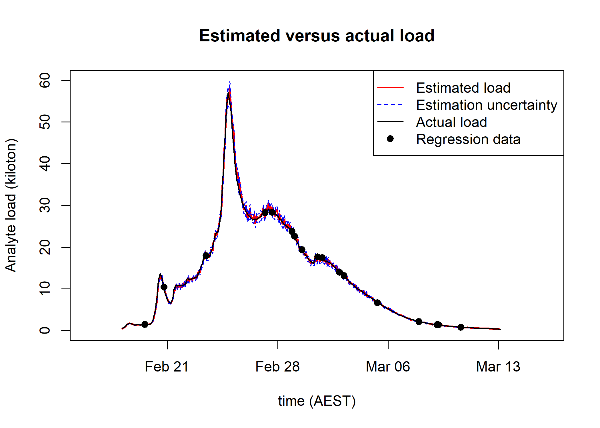

<!-- README.md is generated from README.Rmd. Please edit that file -->

# LinkrealTimeloads

<!-- badges: start -->
<!-- badges: end -->

LinkrealTimeloads provides code to compute suspended-sediment load using
RDI ADCP files, Eagle IO csv files, discharge, and cross-section
surveys. Stephen Wallace provided crucial discussion and the functions
in Import_Channelmaster_Data() that import data from RDI 000 files.

Package code imports, processes, and computes suspended-sediment load
using the CRAN package “realTimeloads”. TSS is predicted from acoustic
backscatter, turbidity, and time-period following Livsey et al (2023) at
<https://doi.org/10.1029/2022WR033982> (see further discussion below).

Package code is designed to allow WQI staff to setup directories for
other sites and compute suspended-sediment loads using ADCP.

## Installation

You can install the development version of LinkrealTimeloads from
[GitHub](https://github.com/) with:

``` r
# install.packages("devtools")
devtools::install_github("dlivsey/LinkrealTimeloads")
```

## Example

Example code and discussion is provided in
vignette(“LinkrealTimeloads”). LinkrealTimeloads::Example() runs code
provided in vignette(“LinkrealTimeloads”) and writes outputs to a
user-specified folder

``` r

library(LinkrealTimeloads)

# This will write outputs to the folder "/LinkreaTimeloads_Output" on your Desktop 
output_folder <-  paste0(file.path(path.expand('~'),'Desktop'),'/LinkreaTimeloads_Output')

Loads <- LinkrealTimeloads::Example(output_folder)
```

## Output

LinkrealTimeloads::Example() returns and writes a list to
output_folder/site/Loads.rds and can be used to generate a plot like the
one below:

<figure>

<figcaption aria-hidden="true">Suspended-sediment load estimated from
the estimates of TSS and discharge estimated from ADCP measurments
collected at 10-minute intervals</figcaption>
</figure>

## References

Livsey, D. N., Downing-Kunz, M. A., Schoellhamer, D. H., & Manning, A.
J. (2020). Suspended sediment flux in the San Francisco Estuary: Part
I—Changes in the vertical distribution of suspended sediment and bias in
estuarine sediment flux measurements. Estuaries and Coasts, 43,
1956-1972.

Livsey, D. N., Turner, R. D. R., & Grace, P. R. (2023). Combining
Optical and Acoustic Backscatter Measurements for Monitoring of Fine
Suspended‐Sediment Concentration Under Changes in Particle Size and
Density. Water Resources Research, 59(8), e2022WR033982.

Livsey, D.N. (in review). National Industry Guidelines for hydrometric
monitoring–Part 12: Application of acoustic Doppler velocity meters to
measure suspended-sediment load. Bureau of Meteorology. Melbourne,
Australia
