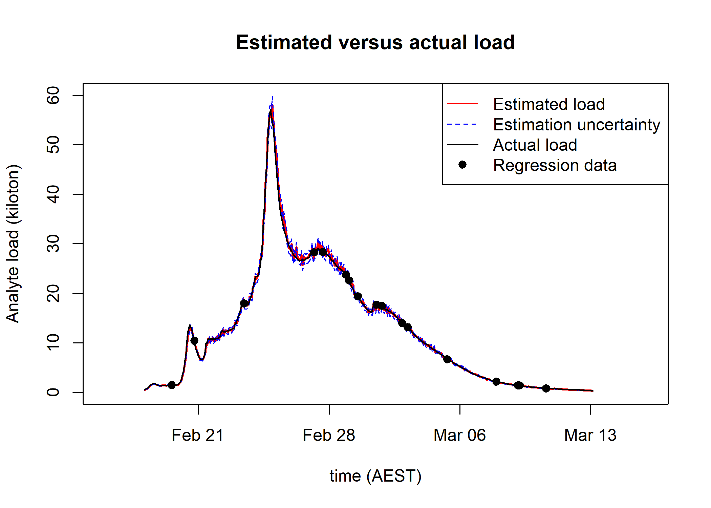

```{r, include = FALSE}
knitr::opts_chunk$set(
  collapse = TRUE,
  comment = "#>",
  warning = FALSE,
  message = FALSE
)
```

# Package overview 

LinkrealTimeloads provides code to compute suspended-sediment load using RDI ADCP files, Eagle IO csv files, discharge, and cross-section surveys. 
Stephen Wallace provided crucial discussion and the functions in Import_Channelmaster_Data() that import data from RDI 000 files.  

Package code imports, processes, and computes suspended-sediment load using the CRAN package "realTimeloads". TSS is predicted from acoustic backscatter, turbidity, and time-period following Livsey et al (2023) at https://doi.org/10.1029/2022WR033982 (see further discussion below). 

Package code is designed to allow WQI staff to setup directories for other sites and compute suspended-sediment loads using ADCP. 

An example is given below on how to setup directories and process data to compute suspended-sediment loads at Johnstone River at Innisfail (JRI). Example data from JRI in /extdata are used for the worked example below. The package has been tested on all data from JRI and Mullgrave River at Deeral. All code in this vignette is implemented in LinkrealTimeloads::Example() and can be used to generate outputs to any  directory. 

# Load library

```{r setup, message = FALSE, eval=FALSE}
library(LinkrealTimeloads)
```

# Initialise folder structure expected by package and place files

initialize_folders_and_move_data_files() uses initialize_new_site_directories() and  writes directories expected by package code. initialize_folders_and_move_data_files() uses data files stored with the package directory at LinkrealTimeloads/extdata

initialize_folders_and_move_data_files() moves files from LinkrealTimeloads/extdata to the following folders: 

1. user_data_folder/site/ADCP_data: 000 files from RDI ADCP 

2. user_data_folder/site/Analyte_data: TSS data from EAGLE IO csv export 

3. user_data_folder/site/Channel_Geometry: Cross-section surveys in xs.RDS from Stephen Wallace 

4. user_data_folder/site/Discharge_data: Discharge csv file from Stephen Wallace 

5. user_data_folder/site/Height_Offsets: Height offset data from EAGLE IO csv export 

6. user_data_folder/site/Sonde_and_Height_data: EXO turbidity, temperature, and specific conductance from EAGLE IO csv export 

```{r, set output folder}
# user_data_folder can be set to any location
# system.file("extdata", package = "LinkrealTimeloads") # automatically returns path to LinkrealTimeloads/extdata

user_data_folder <- paste0(system.file("extdata", package = "LinkrealTimeloads"),'/Example')

# Acronym for "Johnstone River at Innisfail"
site <- 'JRI'

```

```{r initialise folder,results='hide', eval=FALSE}

# Write folders to user_data_folder/site using initialize_new_site_directories() and copy files to appropriate folders
LinkrealTimeloads::initialize_folders_and_move_data_files(user_data_folder,site)

```

# After placing data files into respective folder import, process, and impute data

Users can set "site" to NULL and Link_to_Real_time_loads() will run on all site folders in user_data_folder

Functions in Link_to_Real_time_loads() can be routinely run to check for changes in files (e.g, Import_Channelmaster_Data() will check for new 000 files and for changes in 000 file sizes)

Functions within Link_to_Real_time_loads() writes tables used for QA/QC. These tables will be detailed below. 

```{r import process and impute data, results='hide', eval=FALSE}

# Call Link_to_Real_time_loads() to run package functions in appropriate order. 
LinkrealTimeloads::Link_to_Real_time_loads(user_data_folder,site)

```

# Compute, plot, and report load 

Compute, plot, and report loads using outputs from Link_to_Real_time_loads() and using Compute_load()

Uncertainty on loads can be estimated by setting "compute_uncertainty" to TRUE in Compute_load(); however, uncertainty estimation may add significant run time. Uncertainty is estimated after methods cited in the realTimeloads package

"from_time" and "to_time" (in POSIXct) in Compute_load() can be set to compute total sediment loads between time periods indicated. If these periods are not specified Compute_load() returns the total load computed for all available data. 

```{r compute load, eval=FALSE}

Output <- LinkrealTimeloads::Compute_load(user_data_folder,site)

# Save list with discharge, TSS, and loads for reporting and plotting 
save(Output,file = paste0(paste0(paste0(user_data_folder,'/'),site),'/Loads.rds'))

# Total load in kt is provided in: 
Output$Total_load_kt

path <- paste0(gsub('/vignettes','',getwd()),'/man/figures/README-example-1.png')

```

Data in the list "Output" can be used to generate a plot like the one below. Note that plot below is from synthetic data used in the package realTimeloads. 



# Key tables for QA/QC

Package code outputs the following key tables in rds files:

1) Site_List.rds - provides site number and name for each site folder

2) All_ADCP_Programming_Data.rds - all ADCP readings with metadata for each ADCP reading

3) ADCP_Setting_Summary_Table.rds - time periods when ADCP instrument, settings, and elevation are held constant

4) Processed_Backscatter_data.rds - processed acoustic backscatter from all ADCP readings

5) TSS_estimated_from_SCI_with_metadata.rds - TSS estimates using methods in Livsey et al (2023)

Users will note other .rds files in package outputs (e.g., Sediment_sample.rds). These other rds files are from imports of external data into R (e.g., TSS data from Eagle IO, etc). For each 000 file one rds file written. 

Further comment on ADCP_Setting_Summary_Table.rds and TSS_estimated_from_SCI_with_metadata.rds is provided below

## ADCP_Setting_Summary_Table

A primary function of the package is to determine time periods when ADCP instrument, settings, and elevation are held constant. The ADCP elevation is determined by Offset data exported from Eagle IO.

The table "ADCP_Setting_Summary_Table.rds", output by ADCP_Setting_Summary_Table() and used in Link_to_Real_time_loads above, provides a list of periods and file names allowing the user to determine which 000 ADCP files belong to each period. 

## TSS_estimated_from_SCI_with_metadata.rds

Using ADCP_Setting_Summary_Table.rds, the function Predict_TSS_from_SCI() matches TSS sample data to each period (i.e, row) where ADCP instrument and settings are held constant. Predict_TSS_from_SCI() then assigns each row to a categorical variable (or "factor" in R) called "Period" and uses a generalized linear model to regresses Kt(SCI,Period) where: 

* Kt = dB - 10*log10(TSS) (decibels)
* dB is acoustic backscatter processed from the ADCP (decibels)
* TSS is total suspended-solids (mg/l)
* SCI = dB - 10*log10(Turbidity)(decibels)
* Turbidity is measured from the EXO (FNU)
* Period is a categorical variable (factor)

With timeseries estimates of "Kt", TSS timeseries is be computed via TSS = 0.1dB - 0.1Kt. Details for this approach are given in Livsey et al (2023) (see https://doi.org/10.1029/2022WR033982). Briefly, "Kt" in linear units is the ratio of acoustic backscatter to TSS for a given instrument and suspension of particles. By predicting Kt from SCI, changes in particle size across events can be accounted for when estimating TSS from ADCP. The addition of "Period" as a categorical variable allows data across periods to be pooled since the intercept of Kt(SCI) depends on instrument settings. 

The file "TSS_estimated_from_SCI_with_metadata.rds" is generated by Predict_TSS_from_SCI() and provides timeseries estimates of TSS along with all data used in the regression of Kt(SCI,Period) 

For Johnstone River at Innisfail we do not currently collect TSS samples so I estimate TSS from turbidity measured at JRI using the regression of TSS(turbidity) from Johnstone River at Coquette data. Where possible TSS samples should be used instead of TSS estimated from turbidity. At this time, when using data from JRI, the package code requires data from JRC; however, if another site is used the code will assume TSS samples are available. 


```{r visualise key tables}

# Load ADCP_Setting_Summary_Table for Mullgrave River, this table was not generated by example data provided in package but used all available MRD data at the time of writing

MRD_ADCP_Setting_Summary_Table <- readRDS(paste0(gsub('/vignettes','',getwd()),'/inst/extdata/MRD_ADCP_Setting_Summary_Table.rds'))

# Load ADCP_Setting_Summary_Table for Johnstone River at Innisfail, this table was not generated by example data provided in package but used all available JRI data at the time of writing

JRI_ADCP_Setting_Summary_Table <- readRDS(paste0(gsub('/vignettes','',getwd()),'/inst/extdata/JRI_ADCP_Setting_Summary_Table.rds'))

ADCP_Setting_Summary_Table <- rbind(MRD_ADCP_Setting_Summary_Table,JRI_ADCP_Setting_Summary_Table)

knitr::kable(ADCP_Setting_Summary_Table[c(2,3,5,6,14,15,18,22),c(1,3,11,13)],caption='ADCP Setting Summary Table (subset of columns)',row.names = FALSE)

Regression_data_example <- readRDS(paste0(gsub('/vignettes','',getwd()),'/inst/extdata/RegressionDataExampleforVignette.rds'))

knitr::kable(Regression_data_example,caption='Subset of regression data used to predict Kt(SCI,Period) for JRI',row.names = FALSE)

```

